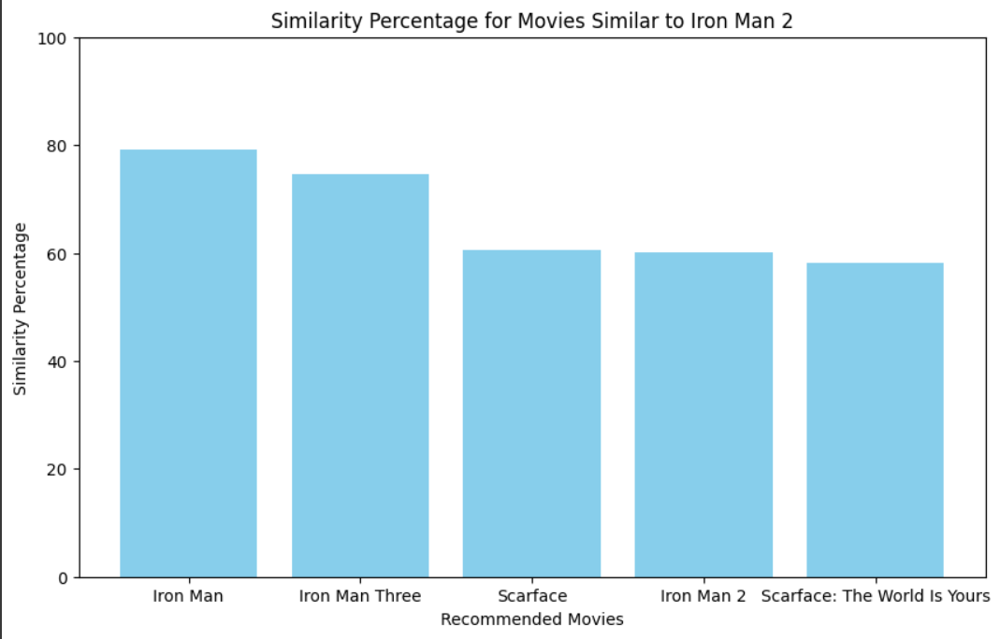

# Movie Similarity Analysis and Recommendation

## Assignment Overview

In this assignment, we conducted an in-depth movie similarity analysis using the Movie Plot Synopses dataset available on Kaggle. You can access the dataset [here](https://www.kaggle.com/cryptexcode/mpst-movie-plot-synopses-with-tags).

## Data Collection

1. **Kaggle Dataset Page:**
   Access the Movie Plot Synopses dataset on Kaggle through the provided [link](https://www.kaggle.com/cryptexcode/mpst-movie-plot-synopses-with-tags).

2. **Download the Dataset:**
   Download the dataset in CSV format using the available option on Kaggle.

## Dataset Contents

- **IMDb ID:**
  Unique identification for each movie, facilitating cross-referencing and analysis.
  
- **Movie Title:**
  Inclusion of movie titles for easy identification and categorization.
  
- **Plot Synopses:**
  Detailed plot synopses provide a rich source of textual data, capturing the narrative essence of each film.

## Text Preprocessing

### Creating Processed Corpus

1. **Tokenization:**
   Break down each synopsis into individual words or tokens, forming a basis for analysis.

2. **Lemmatization:**
   Reduce words to their base or root form using the NLTK library for lemmatization, considering contextual meaning.

3. **Stopword Removal:**
   Utilize the NLTK stopwords list for English to remove common words that do not contribute significantly to meaning.

### Utilized Word Embedding Techniques

1. **Bag of Words (BoW):**
   - Represents each document as an unordered set of words, disregarding grammar and word order.
   

2. **Term Frequency-Inverse Document Frequency (TF-IDF):**
   - Weighs words based on their frequency in the current document against their frequency in the entire dataset.
   

3. **Continuous Bag of Words (CBOW):**
   - Neural network-based word embedding model that captures word semantics.
   

## Similarity Analysis Using Cosine Similarity

Cosine similarity metric is employed to quantify the degree of similarity between movie plot synopses, producing three distinct similarity scores corresponding to BoW, TF-IDF, and CBOW embeddings.

...    |       ...       |      ...

Among the trio, the CBOW model emerged as the frontrunner, showcasing superior performance in capturing subtle nuances and contextual intricacies within the movie synopses.

Noteworthy examples include "Iron Man" and its sequels, where CBOW achieved impressive similarity scores, such as 93.01% for "Iron Man" and 87.84% for "Iron Man 3."

## GitHub Repository

[GitHub Link](https://github.com/Vikas-ABD/Movie_Similarity_Analysis_Recommendation
.git)

## Instructions

1. **Clone the Repository:**
    ```sh
    git clone https://github.com/Vikas-ABD/Movie_Similarity_Analysis_Recommendation
.git
    ```

3. **Install Requirements:**
    ```sh
    pip install -r requirements.txt
    ```

4. **Run the Notebook in Google Colab:**
    Execute the notebook to generate `similarity.pkl` and `data_frame.pkl` files.

5. **Create Streamlit Web Application:**
    - Utilize the generated files for creating a user-friendly Streamlit web application.
    - Extract movie images from the IMDb site through API.

6. **Run the Web Application:**
    ```sh
    streamlit run app.py
    ```
    Access the web application locally for exploring movie recommendations.

## Download required file from the file download_required_files.txt
